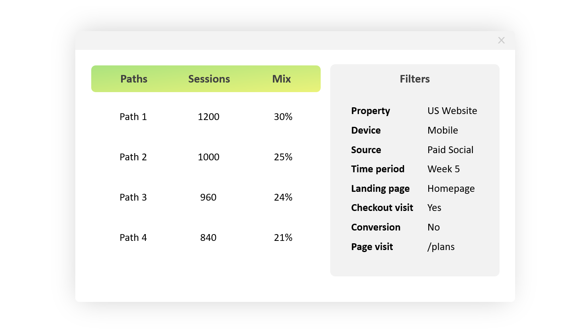

# Top conversion paths
A [BigQuery](https://cloud.google.com/bigquery/) SQL query that can be used to visualize user paths that lead to a conversion, e.g. a sale, on a website or an app.

An example of the presentation of the query output:

The script pulls all pages that were visited by website or app users, and converts each session into a path, e.g.:

` Page 1 > Page 2 > Page 3 > Conversion`

It groups some pages, removes duplicates (e.g. when there was a page refresh or a tracking bug) and removes the ones that were visited after the conversion (e.g. after the sale confirmation page), since we are only interested in paths that lead _to_ the conversion.

## Purpose

The goal was to get more insights into user behaviour prior to conversion and A/B test new ideas. For example, these questions could be answered:
- What non-funnel pages are visited most often by those who convert? Is there some information on those pages that is missing in the funnel or can encourage more users to buy or subscribe?
- How many pages it takes for a user to convert? Is everything clear in the funnel or users go back and forth?
- How user paths differ on different devices and from different sources?
- How specific A/B tests impact user flows? Do users follow a different path, if one of the pages in the funnel is changed?

## Requirements

- A [BigQuery](https://cloud.google.com/bigquery) account (_free or paid_)
- A [Google Analytics 360](https://marketingplatform.google.com/about/analytics-360/) account (_paid_) or a database of user activity with the same [structure of data](https://support.google.com/analytics/answer/3437719?hl=en) that is exported from Google Analytics
- Anything where you can visualize the output of the query (e.g. [Tableau](https://www.tableau.com/) or [Google Spreadsheets](https://www.google.com/drive/) (_free or paid_))

## How to use it

The query is written in BigQuery SQL. You can either:
- Run it in the BigQuery console and export the output to any tool where you can present the results
- Run it in the visualization software that supports connections to BigQuery directly (e.g. Tableau)

## License
[Creative Commons Zero v1.0 Universal](https://choosealicense.com/licenses/cc0-1.0/)
(You can use the script anyway you want for free and without attribution).

## Notes

_This is a small project I worked on in the past, but I would be glad, if it helps anyone_ 🙂
